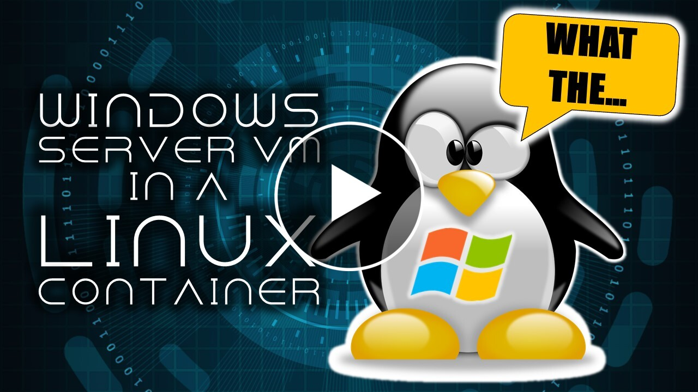

# QEMU in a Linux Container. Run Windows VMs and Connect Via a Browser!

(Yeah... that's about as crazy as it sounds, but hey, it works. )

1. Build the Docker File
2. Run the Docker container
`
docker run -p 8081:8080 -p 8881:8888 -v /root:/isos qemu
`

The -p forwards ports. You can use whatever ports you want, but 8080 is for the NoVNC client, and 8888 is for a web app. It's optional if you don't want to use an app like I did. Use -v to mount a folder to store your iso files and VHD files.

3.  Connect to the container using your browser and select vnc.html. Login to NoVNC. The default password is "password1"
4.  You'll be connected to the container in LXTerminal. You can use Qemu commands to create a the VM
5.  Create a VHD with qemu-img qemu-img: `create -f vpc /isos/server2008.vhd 10G`

	The -f is for format. It creates a VPC format commonly used by hypervisors. The next paramater is the path to the file. Put this outside the container in the folder you mounted. The last paramter is size.
   
6.  Create a new VM: `qemu-system-i386 -cpu pentium -m 2G  -hda /isos/2008.vhd -cdrom /isos/server2008.iso -boot d -nic user,model=e1000,hostfwd=tcp::8888-:80`

	This creates a 32-bit emulation of an x86 CPU. -m tells it yo use 2 Gigs of RAM. The -hda is the path to your VHD. -cdrom is the path to your Windows ISO. -book d tells it to boot from the VHD first. -nic tells it to use SLiRP (a user-mode network stack) and use an e1000 NIC for compatibility. The hostfwd forwards port 8888 from the container to port 80 on the VM.

7. Install Windows and enjoy your VM.
